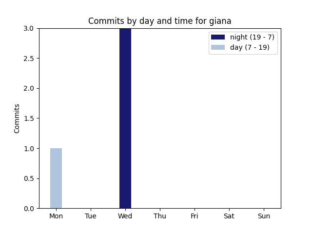
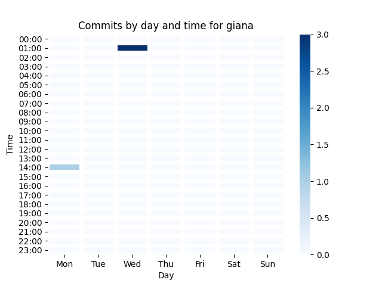

# giana
simple tool for analyzing git commits regarding time

## Dependencies
* bash
* Python 3.9 recommended
* for Python dependencies cp. requirements.txt

## Usage
simply run
> bash giana /path/to/git/repo

## Example
exemplary plots for this repo

### Bar chart

### Heatmap

## License
GPL v3.0

